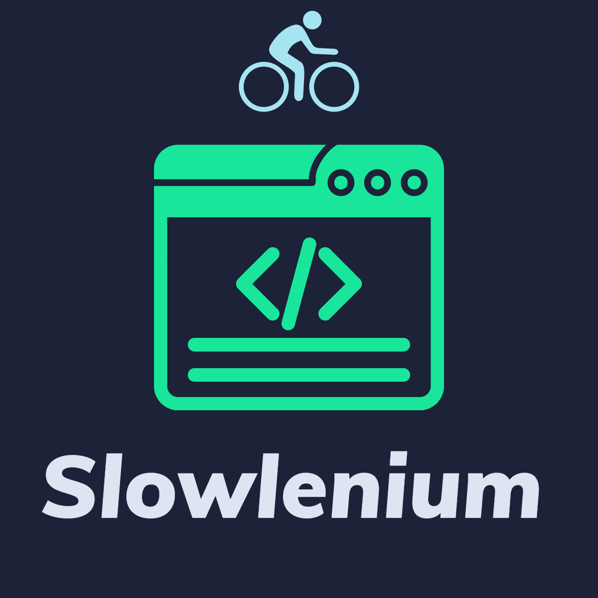

<h1 align="center">
   
  
   
   
  Slowlenium
   
   
</h1>

<h4 align="center">Paced http link loader</h4>

- Python   
- Chromium   
- Selenium   
###########
- TODO: O.S. platform & deps
- TODO: browser driver setup
- TODO: virtualenv init / sourcing
- TODO: pip deps (w/ O.S. req's)
- TODO: license

### Author:
Steve Nolan
